# Quizy Quiz Application

A modern, responsive web-based quiz application built with Python and Flask. Test your knowledge across various topics including general knowledge, sports, history, geography, and programming with an intuitive interface and comprehensive feedback system.

## 🚀 Features

### Core Quiz Features

- **Randomized Questions**: 20 questions randomly selected from a pool of 32+ diverse questions
- **Real-time Scoring**: Instant score tracking with percentage calculation and performance feedback
- **Comprehensive Results**: Detailed performance analysis with visual indicators and personalized messages
- **Enhanced Solutions Page**: Complete review system featuring:
  - ✅ Correct answers highlighted in green with checkmarks
  - ❌ Incorrect user answers marked in red with strikethrough
  - 🔵 Final answers prominently displayed in blue boxes
  - 📊 Score summary with percentage breakdown
  - 📝 Detailed feedback for wrong answers
  - 🎯 Question-by-question breakdown

### Modern User Interface

- **Fully Responsive Design**: Seamless experience on desktop, tablet, and mobile devices
- **Modern Gradient Backgrounds**: Beautiful purple-blue gradient theme throughout
- **Smooth Animations**: Card animations, hover effects, and loading transitions
- **Clean Typography**: Easy-to-read fonts with proper contrast ratios
- **Intuitive Navigation**: Clear buttons and navigation flow between pages
- **Visual Progress Indicators**: Track your progress through the quiz

### Security & Performance

- **CSRF Protection**: Built-in protection against Cross-Site Request Forgery attacks
- **Rate Limiting**: Intelligent rate limiting to prevent abuse and DoS attacks
- **Secure Session Management**: Auto-expiring sessions (1 hour) with secure cookie handling
- **Input Validation & Sanitization**: Protection against malicious input and XSS attacks
- **Error Handling**: Graceful error handling with user-friendly messages

## � Application Flow

### User Journey Flowchart

```mermaid
flowchart TD
    A[🏠 User visits Homepage] --> B[🎯 Start Quiz]
    B --> C[📝 Quiz Interface Loads]
    C --> D[❓ Display Question 1/20]
    D --> E[👤 User selects answer]
    E --> F[📤 Submit answer]
    F --> G{📊 Question < 20?}
    G -->|Yes| H[➡️ Next Question]
    H --> D
    G -->|No| I[🏁 Quiz Complete]
    I --> J[📈 Calculate Score]
    J --> K[🎉 Results Page]
    K --> L{🤔 User Choice}
    L -->|📋 View Solutions| M[📝 Solutions Page]
    L -->|🔄 Retake Quiz| N[🆕 New Quiz Session]
    L -->|🏠 Home| O[🏠 Return to Homepage]
    M --> P{📱 User Action}
    P -->|🔄 Retake Quiz| N
    P -->|🏠 Home| O
    N --> C
    O --> B
    
    style A fill:#667eea,stroke:#764ba2,stroke-width:2px,color:#fff
    style K fill:#4CAF50,stroke:#45a049,stroke-width:2px,color:#fff
    style M fill:#2196F3,stroke:#1976D2,stroke-width:2px,color:#fff
    style I fill:#FF9800,stroke:#F57C00,stroke-width:2px,color:#fff
```



### System Architecture

```mermaid
graph TB
    subgraph "🌐 Frontend Layer"
        A[📱 HTML Templates]
        B[🎨 CSS Styling]
        C[⚡ JavaScript Interactions]
    end
    
    subgraph "🔧 Flask Application"
        D[🚀 quizapp.py - Main App]
        E[❓ quiz.py - Quiz Logic]
        F[🛡️ CSRF Protection]
        G[⏱️ Rate Limiting]
        H[🔐 Session Management]
    end
    
    subgraph "📊 Data Layer"
        I[📝 Question Pool - 32+ Questions]
        J[👤 User Sessions]
        K[📈 Score Tracking]
    end
    
    subgraph "🔒 Security Features"
        L[🛡️ CSRF Tokens]
        M[🚦 Rate Limits]
        N[🔐 Secure Sessions]
        O[✅ Input Validation]
    end
    
    A --> D
    B --> D
    C --> D
    D --> E
    D --> F
    D --> G
    D --> H
    E --> I
    H --> J
    E --> K
    F --> L
    G --> M
    H --> N
    D --> O
    
    style D fill:#667eea,stroke:#764ba2,stroke-width:3px,color:#fff
    style E fill:#4CAF50,stroke:#45a049,stroke-width:2px,color:#fff
    style I fill:#2196F3,stroke:#1976D2,stroke-width:2px,color:#fff
```



### Deployment Architecture

```mermaid
graph LR
    subgraph "🔄 Development"
        A[💻 Local Development]
        B[🔧 Flask Dev Server]
        C[🐍 Python 3.8+]
    end
    
    subgraph "📦 Version Control"
        D[📂 GitHub Repository]
        E[🔄 Git Workflow]
    end
    
    subgraph "🚀 Future Deployment Options"
        F[☁️ Heroku]
        G[🌊 DigitalOcean]
        H[🐙 PythonAnywhere]
        I[🏢 Self-hosted]
    end
    
    A --> B
    B --> C
    A --> E
    E --> D
    D --> F
    D --> G
    D --> H
    D --> I
    
    style A fill:#667eea,stroke:#764ba2,stroke-width:2px,color:#fff
    style D fill:#4CAF50,stroke:#45a049,stroke-width:2px,color:#fff
    style F fill:#FF5722,stroke:#D84315,stroke-width:2px,color:#fff
    style G fill:#2196F3,stroke:#1976D2,stroke-width:2px,color:#fff
    style H fill:#FF9800,stroke:#F57C00,stroke-width:2px,color:#fff
    style I fill:#9C27B0,stroke:#7B1FA2,stroke-width:2px,color:#fff
```



## �🛠️ Installation & Setup

### Prerequisites

- **Python 3.8 or higher** 
  - Windows: Download from [python.org](https://www.python.org/downloads/windows/)
  - macOS: Download from [python.org](https://www.python.org/downloads/mac-osx/) or use Homebrew
  - Linux: Usually pre-installed, or install via package manager
- **pip** (Python package manager) - included with Python 3.4+

### Installation Steps

1. **Clone the repository**:
   ```bash
   # Windows (Command Prompt/PowerShell)
   git clone https://github.com/Roz4Tech/QuizyWebApp.git
   cd QuizyWebApp
   
   # Linux/macOS (Terminal)
   git clone https://github.com/Roz4Tech/QuizyWebApp.git
   cd QuizyWebApp
   ```

2. **Set up a virtual environment** (recommended):
   ```bash
   # Windows (Command Prompt)
   python -m venv venv
   venv\Scripts\activate
   
   # Windows (PowerShell)
   python -m venv venv
   venv\Scripts\Activate.ps1
   
   # Linux/macOS
   python3 -m venv venv
   source venv/bin/activate
   ```

3. **Install dependencies**:
   
   **Option A - Simple Installation (Recommended):**
   ```bash
   # Windows
   pip install flask flask-wtf
   
   # Linux/macOS
   pip3 install flask flask-wtf
   ```
   
   **Option B - System Package Installation (Linux only):**
   ```bash
   # Ubuntu/Debian
   sudo apt install python3-flask python3-flask-wtf
   
   # Fedora/RHEL
   sudo dnf install python3-flask python3-flask-wtf
   ```
   
   **Option C - For Externally Managed Environments:**
   ```bash
   pip install --break-system-packages flask flask-wtf
   ```

4. **Set up environment variables** (optional):
   ```bash
   # Windows (Command Prompt)
   set FLASK_SECRET_KEY=your-secure-secret-key
   
   # Windows (PowerShell)
   $env:FLASK_SECRET_KEY="your-secure-secret-key"
   
   # Linux/macOS
   export FLASK_SECRET_KEY=your-secure-secret-key
   ```
## 🚦 Running the Application

1. **Start the Flask application**:
   ```bash
   # Windows (Command Prompt/PowerShell)
   cd Quiz
   python quizapp.py
   
   # Linux/macOS (Terminal)
   cd Quiz
   python3 quizapp.py
   ```

2. **Access the application**:
   Open your web browser and navigate to:
   ```
   http://127.0.0.1:5000/
   ```
   Or alternatively:
   ```
   http://localhost:5000/
   ```

3. **Start taking the quiz!**
   - Click "Start Quiz" to begin your 20-question challenge
   - Select your answers for each question
   - View your results with detailed scoring
   - Review all questions and correct answers on the Solutions page
   - Challenge yourself again with "Try Again"

### Troubleshooting

**Windows Users:**
- If `python` command is not recognized, try `py` instead
- Make sure Python is added to your PATH during installation
- For PowerShell execution policy issues, run: `Set-ExecutionPolicy -ExecutionPolicy RemoteSigned -Scope CurrentUser`

**Linux/macOS Users:**
- Use `python3` instead of `python` if you have multiple Python versions
- Ensure you have the required permissions for package installation

**All Platforms:**
- If you see "Port already in use" error, stop any existing Flask apps or use a different port:
  ```bash
  # Windows
  python quizapp.py --port 5001
  
  # Linux/macOS  
  python3 quizapp.py --port 5001
  ```

## 📱 Application Flow

### 1. **Home Page** (`/`)
- Welcome screen with quiz introduction
- Automatically redirects to start a new quiz session
- Initializes 20 random questions from the question pool

### 2. **Quiz Interface** (`/quiz`)
- Clean, focused question display
- Multiple choice options with radio buttons
- Progress tracking (Question X of 20)
- Submit answers and navigate through questions
- Automatic progression to results after 20 questions

### 3. **Results Page** (`/results`)
- Final score display (X/20 format)
- Percentage calculation with performance feedback
- Personalized congratulatory messages based on score
- "View Solutions" button for detailed review
- "Try Again" option to restart with new questions

### 4. **Solutions Page** (`/solutions`)
- **Complete Question Review**: All 20 questions with full context
- **Answer Analysis**: 
  - ✅ Correct answers in green with checkmarks
  - ❌ Your wrong answers in red with strikethrough
  - ⚪ Neutral options in gray
- **Final Answer Boxes**: Blue highlighted sections showing correct answers
- **Feedback Sections**: "Your answer vs Correct answer" for mistakes
- **Score Summary**: Prominent display of final score and percentage
- **Navigation**: "Back to Home" button to start a new quiz

## 📁 Project Structure

```
Quiz/
├── quizapp.py               # Main Flask application with routes and logic
├── quiz.py                  # Question and Quiz class definitions
├── README.md                # Comprehensive documentation (this file)
├── requirements.txt         # Python dependencies list
├── static/                  # Static assets
│   ├── style.css           # Main stylesheet for quiz interface
│   └── Quizy Logo.png      # Application logo and branding
├── templates/               # Jinja2 HTML templates
│   ├── quiz.html           # Interactive quiz question interface
│   ├── results.html        # Score display and results page
│   └── solution.html       # Comprehensive solutions review page
└── __pycache__/            # Python bytecode cache (auto-generated)
```

## 🎯 Question Categories

The quiz covers diverse topics including:

- **🌍 Geography**: Countries, capitals, landmarks, and world facts
- **🏃‍♂️ Sports**: Athletes, records, and sporting events
- **💻 Programming**: Python basics, web development, and computer science
- **🎨 General Knowledge**: Science, history, and cultural facts
- **🔢 Mathematics**: Basic arithmetic and logical reasoning
- **🌟 Trivia**: Fun facts and interesting knowledge

## 🎮 How to Use

### Taking Your First Quiz

1. **Launch the Application**:
   ```bash
   # Windows
   python quizapp.py
   
   # Linux/macOS
   python3 quizapp.py
   ```
   Navigate to `http://localhost:5000` in your browser

2. **Start the Quiz**:
   - The homepage automatically initializes a new quiz session
   - 20 questions are randomly selected from the question pool
   - You'll be redirected to the first question

3. **Answer Questions**:
   - Read each question carefully
   - Select one of the three multiple-choice options
   - Click "Submit" to move to the next question
   - Your answers are automatically saved

4. **View Results**:
   - After 20 questions, see your final score and percentage
   - Get personalized feedback based on performance:
     - 90%+: "Outstanding performance! You're a quiz master!"
     - 70%+: "Great job! You have a good grasp of the material."
     - 50%+: "Not bad! With practice, you'll improve even more!"
     - <50%: "Keep learning! Review the solutions and try again!"

5. **Review Solutions**:
   - Click "View Solutions" for comprehensive review
   - See all questions with complete answer breakdowns
   - Understand your mistakes with detailed feedback
   - Use "Back to Home" to take another quiz

### Platform-Specific Features

**Windows Users:**
- **File Explorer Integration**: Right-click in the Quiz folder → "Open PowerShell window here"
- **Windows Terminal**: Enhanced command-line experience with tabs and themes
- **Task Manager**: Monitor Python process performance (Ctrl+Shift+Esc)

**macOS Users:**
- **Terminal Integration**: Use Spotlight (Cmd+Space) to quickly open Terminal
- **Activity Monitor**: Monitor Python process in Applications/Utilities
- **Finder Integration**: Navigate to project folder easily

**Linux Users:**
- **Desktop Environment**: Works with all major Linux distributions (Ubuntu, Fedora, openSUSE, etc.)
- **System Monitor**: Use htop or system monitor to track performance
- **Package Managers**: Alternative installation via apt, dnf, pacman, etc.

### Responsive Design Features

- **📱 Mobile Optimized**: Touch-friendly interface for smartphones
- **💻 Desktop Enhanced**: Full-screen experience with hover effects  
- **📐 Tablet Ready**: Perfect layout for iPad and tablet devices
- **🔄 Auto-Adapting**: Grid layouts adjust based on screen size
- **🌐 Cross-Browser**: Works on Chrome, Firefox, Safari, Edge

## � Deployment & GitHub

### Pushing to GitHub

If you haven't pushed to GitHub yet, follow these steps:

1. **Initialize Git Repository** (if not already done):
   ```bash
   # Windows (Command Prompt/PowerShell)
   git init
   git add .
   git commit -m "Initial commit: Quiz application with responsive design"
   
   # Linux/macOS (Terminal)
   git init
   git add .
   git commit -m "Initial commit: Quiz application with responsive design"
   ```

2. **Create GitHub Repository**:
   - Go to [GitHub.com](https://github.com)
   - Click "New Repository"
   - Name it "Quiz-Application" or similar
   - Don't initialize with README (you already have one)

3. **Connect and Push**:
   ```bash
   # All platforms (replace 'yourusername' with your GitHub username)
   git remote add origin https://github.com/Roz4Tech/QuizyWebApp.git
   git branch -M main
   git push -u origin main
   ```

### Production Deployment

**Option 1 - Using Gunicorn (Linux/macOS):**
```bash
pip3 install gunicorn
gunicorn -w 4 -b 0.0.0.0:8000 quizapp:app
```

**Option 2 - Using Waitress (Windows/Cross-platform):**
```bash
# Windows/Linux/macOS
pip install waitress
waitress-serve --host=0.0.0.0 --port=8000 quizapp:app
```

**Option 3 - Using Docker (All platforms):**
```bash
# Create Dockerfile first, then:
docker build -t quiz-app .
docker run -p 5000:5000 quiz-app
```

### Platform-Specific Deployment Notes

**Windows Deployment:**
- **IIS Integration**: Can be deployed using IIS with Python CGI
- **Windows Service**: Use `pywin32` to run as Windows service
- **Task Scheduler**: Schedule automatic restarts if needed

**Linux Deployment:**
- **Systemd Service**: Create service files for automatic startup
- **Nginx/Apache**: Use as reverse proxy for production
- **PM2**: Process manager for Node.js-style management

**Cloud Deployment (All platforms):**
- **Heroku**: Easy deployment with Git integration
- **AWS EC2**: Full control with any OS
- **Google Cloud**: App Engine or Compute Engine
- **Azure**: App Service or Virtual Machines

# Using Docker
docker build -t quiz-app .
docker run -p 5000:5000 quiz-app
```

## �📝 Adding More Questions

### Question Format

Questions are stored in the `create_quiz()` function in `quizapp.py`. Each question follows this format:

```python
(
    "Your question text here?",                    # Question (string)
    ["Option A", "Option B", "Option C"],          # 3 answer choices (list)
    1                                              # Correct answer index (0, 1, or 2)
)
```

### Current Question Pool

The application includes 32+ questions covering:
- World geography and capitals
- Sports records and athletes  
- Programming fundamentals
- Science and mathematics
- History and general knowledge
- Cultural trivia

### Adding New Questions

1. **Edit the Question Pool**:
   ```bash
   # Open the main application file
   nano quizapp.py  # or your preferred editor
   ```

2. **Locate the questions list** in the `create_quiz()` function

3. **Add your question** following the format:
   ```python
   ("What is the capital of Australia?", ["Sydney", "Canberra", "Melbourne"], 1),
   ```

4. **Save and restart** the application:
   ```bash
   # Windows
   python quizapp.py
   
   # Linux/macOS
   python3 quizapp.py
   ```

### Question Guidelines

- ✅ **Clear and Concise**: Keep questions easy to understand
- ✅ **Single Correct Answer**: Ensure only one option is definitively correct
- ✅ **Balanced Difficulty**: Mix easy, medium, and challenging questions
- ✅ **Diverse Topics**: Cover various subjects for broad appeal
- ✅ **Avoid Ambiguity**: Make sure questions have clear, unambiguous answers
- ✅ **Consistent Length**: Keep options roughly similar in length

## 🔒 Security

### Reporting Security Issues

If you discover a security vulnerability, please report it by emailing `security@example.com`. All security vulnerabilities will be promptly addressed.

### Security Features

- CSRF protection
- Rate limiting
- Secure session management
- Input sanitization
- Dependabot for dependency updates

## 📄 License

This project is licensed under the MIT License - see the [LICENSE](LICENSE) file for details.

## 🤝 Contributing

We welcome contributions! Here's how you can help improve the quiz application:

### How to Contribute

1. **Fork the Repository**:
   ```bash
   # Fork on GitHub, then clone your fork
   git clone https://github.com/Roz4Tech/QuizyWebApp.git
   cd QuizyWebApp
   ```

2. **Create a Feature Branch**:
   ```bash
   git checkout -b feature/your-amazing-feature
   ```

3. **Make Your Changes**:
   - Add new questions to expand the question pool
   - Improve the UI/UX design
   - Add new features (timer, categories, difficulty levels)
   - Fix bugs or improve performance
   - Enhance documentation

4. **Test Your Changes**:
   ```bash
   python3 quizapp.py
   # Test thoroughly on different devices and browsers
   ```

5. **Commit and Push**:
   ```bash
   git add .
   git commit -m "Add: Brief description of your changes"
   git push origin feature/your-amazing-feature
   ```

6. **Open a Pull Request** on GitHub with a clear description

### Ideas for Contributions

- 🎯 **More Questions**: Add questions in new categories
- ⏱️ **Timer Feature**: Add time limits for added challenge
- 🏆 **Leaderboard**: Track high scores and achievements
- 🎨 **Themes**: Multiple color schemes and visual themes
- 📊 **Analytics**: Detailed performance statistics
- 🔊 **Accessibility**: Screen reader support and keyboard navigation
- 🌐 **Internationalization**: Multi-language support

---

## 📄 License

This project is licensed under the MIT License - see the [LICENSE](LICENSE) file for details.

### License Summary
- ✅ **Commercial Use**: You can use this software commercially
- ✅ **Modification**: You can modify the source code
- ✅ **Distribution**: You can distribute copies of the software
- ✅ **Private Use**: You can use the software privately
- ❗ **Liability**: The software comes without warranty
- ❗ **License Notice**: Must include copyright and license notice

## 🙏 Acknowledgments

- **Flask Framework**: For the robust web application foundation
- **Modern CSS**: For responsive design and smooth animations
- **Open Source Community**: For inspiration and best practices
- **Contributors**: Everyone who helps improve this project

---

## � Support & Contact

- **Issues**: Report bugs on [GitHub Issues](https://github.com/Roz4Tech/QuizyWebApp/issues)
- **Discussions**: Join conversations in [GitHub Discussions](https://github.com/Roz4Tech/QuizyWebApp/discussions)
- **Email**: Contact for major issues or suggestions

---

**Made with ❤️ using Python & Flask | © 2025 Quizy Web Application**
